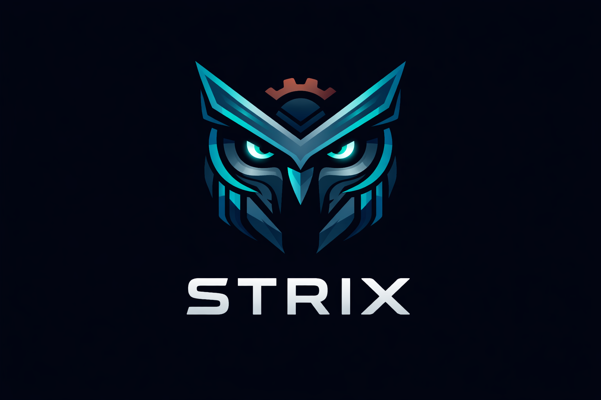

<p align="center">
  
</p>

<h1 align="center">Strix</h1>

<p align="center">
  <strong>A modern, high-performance S3-compatible object storage server written in Rust</strong>
</p>

<p align="center">
  <a href="https://www.rust-lang.org/"></a>
  <a href="https://leptos.dev/"></a>
  <a href="LICENSE"></a>
  <a href="#"></a>
</p>

<p align="center">
  <a href="#features"></a>
  <a href="#features"></a>
  <a href="#features"></a>
  <a href="#features"></a>
  <a href="#features"></a>
  <a href="#features"></a>
</p>

<p align="center">
  
  
  
</p>

---

> ⚠️ **Experimental Proof of Concept (PoC)** - Strix is currently a proof-of-concept project in active development. It is suitable for testing, evaluation, and iterative development, but it is **not yet production-ready** for critical workloads or long-term data retention. Expect breaking changes while core features, operational maturity, and distributed capabilities continue to evolve.

---

## Why Strix?

**Strix** is a drop-in replacement for MinIO, built from the ground up in safe Rust. It provides S3-compatible object storage with a modern web console, all compiled into a single binary.

| Feature | Strix | MinIO | Notes |
|---------|-------|-------|-------|
| Language | Rust | Go | Memory safety without GC |
| Unsafe Code | 0% | N/A | No unsafe blocks |
| Web Console | Leptos (WASM) | React | Embedded in binary |
| Binary Size | ~15MB | ~100MB | Single static binary |
| Memory Usage | Low | Medium | No garbage collector |
| S3 Compatible | ✅ | ✅ | AWS SDK compatible |

## Features

### Core Storage
- **S3 API Compatible** - Works with AWS SDKs, s3cmd, rclone, and any S3 client
- **Multipart Uploads** - Upload large files in parallel chunks
- **Pre-signed URLs** - Generate temporary access URLs for sharing
- **Object Versioning** - Keep historical versions of objects
- **Server-Side Encryption** - SSE-S3 and SSE-C encryption modes

### Security & Access Control
- **IAM Users & Groups** - Create users with access keys
- **IAM Policies** - Fine-grained access control with JSON policies
- **Bucket Policies** - S3-style bucket access policies
- **AWS Signature V4** - Standard S3 authentication

### Operations
- **Web Console** - Modern Leptos-based admin UI
- **CLI Tool (sx)** - Full-featured command-line interface
- **REST Admin API** - Programmatic server management
- **Prometheus Metrics** - Built-in monitoring endpoint
- **Health Checks** - Kubernetes-ready liveness/readiness probes

### Advanced Features
- **Audit Logging** - Security event tracking with query API
- **CORS Configuration** - Cross-origin resource sharing per bucket
- **Streaming Transfers** - Memory-efficient large object handling
- **Rate Limiting** - Configurable request throttling per IP

### Coming Soon
- Object Locking (WORM)
- Lifecycle Rules
- Event Notifications
- LDAP/OIDC Integration
- Distributed Mode with Erasure Coding

## Quick Start

### Using Docker

```bash
docker run -d \
  --name strix \
  -p 9000:9000 \
  -p 9001:9001 \
  -e STRIX_ROOT_USER=admin \
  -e STRIX_ROOT_PASSWORD=password123 \
  -v strix-data:/var/lib/strix \
  ghcr.io/strix-storage/strix:latest
```

### From Source

```bash
# Clone the repository
git clone https://github.com/strix-storage/strix.git
cd strix

# Build release binary
cargo build --release

# Run the server
STRIX_ROOT_USER=admin STRIX_ROOT_PASSWORD=password123 \
  ./target/release/strix --data-dir ./data
```

### Access the Console

Open [http://localhost:9001](http://localhost:9001) and log in with your root credentials.

## Configuration

Strix can be configured via command-line flags or environment variables:

| Flag | Environment Variable | Default | Description |
|------|---------------------|---------|-------------|
| `--address` | `STRIX_ADDRESS` | `0.0.0.0:9000` | S3 API listen address |
| `--console-address` | `STRIX_CONSOLE_ADDRESS` | `0.0.0.0:9001` | Web console address |
| `--metrics-address` | `STRIX_METRICS_ADDRESS` | `127.0.0.1:9090` | Prometheus metrics address |
| `--data-dir` | `STRIX_DATA_DIR` | `/var/lib/strix` | Data storage directory |
| `--root-user` | `STRIX_ROOT_USER` | (required) | Root access key |
| `--root-password` | `STRIX_ROOT_PASSWORD` | (required) | Root secret key |
| `--jwt-secret` | `STRIX_JWT_SECRET` | (unset) | Base64 JWT signing secret (32+ decoded bytes recommended) |
| `--log-level` | `STRIX_LOG_LEVEL` | `info` | Log level (trace/debug/info/warn/error) |
| `--log-json` | `STRIX_LOG_JSON` | `false` | Enable JSON log format |
| `--s3-rate-limit` | `STRIX_S3_RATE_LIMIT` | `1000` | Max S3 requests/min per IP (0=disabled) |
| `--multipart-expiry-hours` | `STRIX_MULTIPART_EXPIRY_HOURS` | `24` | Hours before stale multipart uploads are cleaned |

### Security Notes

- If `STRIX_JWT_SECRET` is unset, admin JWT signing uses a random process-local secret; sessions are invalidated on restart.
- Metrics now bind to loopback by default (`127.0.0.1:9090`). Set `STRIX_METRICS_ADDRESS=0.0.0.0:9090` only when intentionally exposing metrics behind trusted network controls.

## Using with AWS CLI

```bash
# Configure AWS CLI
aws configure set aws_access_key_id admin
aws configure set aws_secret_access_key password123

# Create a bucket
aws --endpoint-url http://localhost:9000 s3 mb s3://my-bucket

# Upload a file
aws --endpoint-url http://localhost:9000 s3 cp file.txt s3://my-bucket/

# List objects
aws --endpoint-url http://localhost:9000 s3 ls s3://my-bucket/

# Download a file
aws --endpoint-url http://localhost:9000 s3 cp s3://my-bucket/file.txt ./downloaded.txt
```

## Using the Strix CLI (sx)

```bash
# Set up an alias
sx alias set local http://localhost:9000 admin password123

# List buckets
sx ls local

# Create a bucket
sx mb local/my-bucket

# Upload files
sx cp file.txt local/my-bucket/
sx cp -r ./folder/ local/my-bucket/backup/

# Download files
sx cp local/my-bucket/file.txt ./

# Get object info
sx stat local/my-bucket/file.txt

# Remove objects
sx rm local/my-bucket/file.txt

# User management
sx admin user add local alice
sx admin user list local
```

## Architecture

```
┌─────────────────────────────────────────────────────────────┐
│                         Strix                                │
├─────────────────────────────────────────────────────────────┤
│  ┌─────────────┐  ┌─────────────┐  ┌─────────────────────┐  │
│  │   S3 API    │  │ Admin API   │  │    Web Console      │  │
│  │  (s3s)      │  │  (axum)     │  │    (Leptos)         │  │
│  │  :9000      │  │  :9001      │  │    embedded         │  │
│  └──────┬──────┘  └──────┬──────┘  └──────────┬──────────┘  │
│         │                │                     │             │
│         └────────────────┴─────────────────────┘             │
│                          │                                   │
│  ┌───────────────────────┴───────────────────────────────┐  │
│  │                    Core Services                       │  │
│  ├───────────────┬───────────────┬───────────────────────┤  │
│  │  IAM Store    │  Policy Engine │  Crypto (Sig V4)     │  │
│  │  (SQLite)     │  (IAM+Bucket)  │  (SHA256, HMAC)      │  │
│  └───────────────┴───────────────┴───────────────────────┘  │
│                          │                                   │
│  ┌───────────────────────┴───────────────────────────────┐  │
│  │                   Storage Layer                        │  │
│  │              Local Filesystem Backend                  │  │
│  │         (MessagePack metadata + raw data)              │  │
│  └────────────────────────────────────────────────────────┘  │
└─────────────────────────────────────────────────────────────┘
```

## Documentation

- [API Reference](docs/api-reference.md) - S3 and Admin API documentation
- [Configuration Guide](docs/configuration.md) - Detailed configuration options
- [CLI Reference](docs/cli-reference.md) - Complete sx command reference
- [S3 Compatibility](docs/s3-compatibility.md) - S3 API compatibility matrix
- [Tool Compatibility Testing](docs/tool-compatibility-testing.md) - Practical AWS CLI, restic, rclone, and s3cmd validation steps
- [IAM & Policies](docs/iam-policies.md) - Access control documentation
- [Architecture](docs/architecture.md) - System design and internals

## Project Structure

```
strix/
├── strix/                 # Main binary
├── crates/
│   ├── strix-core/        # Shared types and traits
│   ├── strix-s3/          # S3 API implementation (s3s)
│   ├── strix-storage/     # Storage backend
│   ├── strix-iam/         # Users, policies, access keys
│   ├── strix-crypto/      # Signatures, hashing
│   ├── strix-admin/       # Admin REST API
│   ├── strix-gui/         # Leptos web console
│   └── strix-cli/         # CLI tool (sx)
└── docs/                  # Documentation
```

## Building from Source

### Prerequisites

- Rust 1.85+ (edition 2024)
- Trunk (for building the GUI): `cargo install trunk`
- wasm32 target: `rustup target add wasm32-unknown-unknown`

### Build Steps

```bash
# Build all crates
cargo build --release

# Build the GUI (optional, for development)
cd crates/strix-gui
trunk build --release

# Run tests
cargo test --workspace

# Run the server
./target/release/strix --help
```

## Contributing

Contributions are welcome! Please read our [Contributing Guide](CONTRIBUTING.md) for details.

### Development Setup

```bash
# Clone and enter the repo
git clone https://github.com/strix-storage/strix.git
cd strix

# Run in development mode
STRIX_ROOT_USER=admin STRIX_ROOT_PASSWORD=admin123 \
  cargo run -- --data-dir ./dev-data --log-level debug

# Run tests
cargo test --workspace

# Check formatting
cargo fmt --all -- --check

# Run clippy
cargo clippy --workspace -- -D warnings
```

## License

Strix is licensed under the [GNU Affero General Public License v3.0](LICENSE).

## Acknowledgments

- [s3s](https://github.com/Nugine/s3s) - S3 server framework for Rust
- [Leptos](https://leptos.dev/) - Full-stack Rust web framework
- [Axum](https://github.com/tokio-rs/axum) - Ergonomic web framework
- [MinIO](https://min.io/) - Inspiration for the project

---

<p align="center">
  <strong>Built with 🦀 Rust</strong>
</p>
