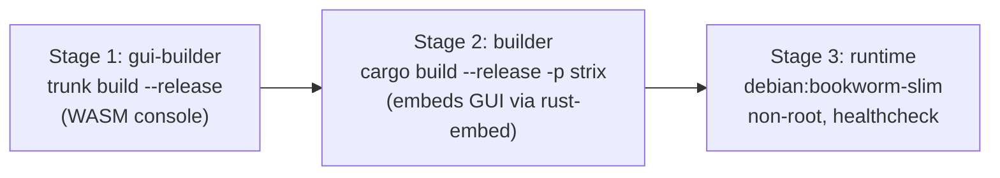

# Docker Deployment

Strix ships as a single self-contained image: one binary that serves the S3 API,
the web console, the Admin API, and (optionally) a metrics endpoint. The web
console (WASM) is compiled and embedded into the binary at build time, so the
runtime image has no extra moving parts.

This guide covers running the published image, building your own, the full
Compose stack, and every setting you can pass.

## Image Layout

The [`deploy/Dockerfile`](https://github.com/CK-Technology/strix/blob/main/deploy/Dockerfile)
is a three-stage build:



| Stage | Base | Produces |
|-------|------|----------|
| `gui-builder` | `rust:1.96-bookworm` | `crates/strix-gui/dist/` (WASM + assets) |
| `builder` | `rust:1.96-bookworm` | `target/release/strix` with embedded GUI |
| runtime | `debian:bookworm-slim` | final image, runs as non-root `strix` user |

The runtime image:

- Runs as a non-root `strix` user.
- Exposes `9000` (S3 API) and `9001` (console + Admin API).
- Declares a `VOLUME` at `/var/lib/strix` for persistent data.
- Has a built-in `HEALTHCHECK` hitting `/health/ready`.

## Run the Published Image

```bash
docker run -d \
  --name strix \
  -p 9000:9000 \
  -p 9001:9001 \
  -e STRIX_ROOT_USER=admin \
  -e STRIX_ROOT_PASSWORD=change-me \
  -v strix-data:/var/lib/strix \
  ghcr.io/ck-technology/strix:latest
```

- **S3 API:** http://localhost:9000
- **Web console:** http://localhost:9001 (log in with the root credentials)

The metrics port (`9090`) binds to loopback inside the container and is **not**
published. See [Monitoring](#monitoring-prometheus--grafana) to expose it safely.

## Compose Stack

The repository ships a ready-to-use stack under
[`deploy/`](https://github.com/CK-Technology/strix/tree/main/deploy):

| File | Purpose |
|------|---------|
| `docker-compose.yml` | Main stack (builds from source, or use a pre-built image) |
| `docker-compose.prod.yml` | Production overrides — resource limits, log rotation, JSON logs |
| `docker-compose.monitoring.yml` | Exposes metrics to Prometheus inside the Docker network |
| `.env.example` | Documented template for every supported variable |
| `prometheus.yml` | Prometheus scrape config |

### Start it

```bash
cd deploy

# Configure: at minimum set STRIX_ROOT_PASSWORD
cp .env.example .env
$EDITOR .env

docker compose up -d
docker compose logs -f strix
```

### docker-compose.yml

The core service definition. Ports and credentials are driven by `.env`; the
metrics port is intentionally left unpublished.

```yaml
services:
  strix:
    build:
      context: ..
      dockerfile: deploy/Dockerfile
    image: strix:latest
    container_name: strix
    restart: unless-stopped
    ports:
      - "${STRIX_PORT_S3:-9000}:9000"
      - "${STRIX_PORT_CONSOLE:-9001}:9001"
    environment:
      STRIX_ROOT_USER: ${STRIX_ROOT_USER:-admin}
      STRIX_ROOT_PASSWORD: ${STRIX_ROOT_PASSWORD:?STRIX_ROOT_PASSWORD is required}
      STRIX_LOG_LEVEL: ${STRIX_LOG_LEVEL:-info}
      STRIX_LOG_JSON: ${STRIX_LOG_JSON:-false}
      STRIX_JWT_SECRET: ${STRIX_JWT_SECRET:-}
      STRIX_MULTIPART_EXPIRY_HOURS: ${STRIX_MULTIPART_EXPIRY_HOURS:-24}
      STRIX_S3_RATE_LIMIT: ${STRIX_S3_RATE_LIMIT:-1000}
      STRIX_METRICS_ADDRESS: ${STRIX_METRICS_ADDRESS:-127.0.0.1:9090}
      STRIX_OTLP_ENDPOINT: ${STRIX_OTLP_ENDPOINT:-}
      STRIX_SERVICE_NAME: ${STRIX_SERVICE_NAME:-strix}
    volumes:
      - strix-data:/var/lib/strix
    healthcheck:
      test: ["CMD", "curl", "-f", "http://localhost:9000/health/ready"]
      interval: 30s
      timeout: 10s
      retries: 3
      start_period: 5s

volumes:
  strix-data:
```

> `STRIX_ROOT_PASSWORD` uses the `:?` form, so Compose refuses to start if it is
> unset — there is no silent default password.

### Use a pre-built image instead of building

To skip the local build, layer the production override (or set `image:`
directly):

```bash
docker compose -f docker-compose.yml -f docker-compose.prod.yml up -d
```

`docker-compose.prod.yml` switches to a pre-built image and adds resource
limits, `restart: always`, JSON logging, and log rotation:

```yaml
services:
  strix:
    image: ${STRIX_IMAGE:-ghcr.io/ck-technology/strix:latest}
    build: !reset null
    restart: always
    deploy:
      resources:
        limits:   { cpus: '4', memory: 4G }
        reservations: { cpus: '1', memory: 1G }
    logging:
      driver: json-file
      options: { max-size: "100m", max-file: "5" }
    environment:
      STRIX_LOG_JSON: "true"
```

## Settings Reference

All settings are environment variables (the binary also accepts matching
`--flags`). Full details: [Configuration](configuration.md).

### Core

| Variable | Default | Description |
|----------|---------|-------------|
| `STRIX_ROOT_USER` | `admin` | Root access key ID |
| `STRIX_ROOT_PASSWORD` | (required) | Root secret — Compose refuses to start without it |
| `STRIX_DATA_DIR` | `/var/lib/strix` | Data directory (the declared volume) |
| `STRIX_ADDRESS` | `0.0.0.0:9000` | S3 API bind address (inside the container) |
| `STRIX_CONSOLE_ADDRESS` | `0.0.0.0:9001` | Console + Admin API bind address |
| `STRIX_METRICS_ADDRESS` | `127.0.0.1:9090` | Metrics bind address (loopback by default) |
| `STRIX_JWT_SECRET` | (random per boot) | Base64, ≥32 decoded bytes. Set it so admin sessions survive restarts |

### Logging & telemetry

| Variable | Default | Description |
|----------|---------|-------------|
| `STRIX_LOG_LEVEL` | `info` | `trace`/`debug`/`info`/`warn`/`error` |
| `STRIX_LOG_JSON` | `false` | JSON log lines for aggregators |
| `STRIX_OTLP_ENDPOINT` | (unset) | OTLP traces endpoint, e.g. `http://jaeger:4317` |
| `STRIX_SERVICE_NAME` | `strix` | Service name reported in telemetry |

### S3 behavior

| Variable | Default | Description |
|----------|---------|-------------|
| `STRIX_S3_RATE_LIMIT` | `1000` | Max S3 requests/min per IP (`0` = disabled) |
| `STRIX_MULTIPART_EXPIRY_HOURS` | `24` | Hours before stale multipart uploads are reaped |

### Compose-only port mappings

| Variable | Default | Description |
|----------|---------|-------------|
| `STRIX_PORT_S3` | `9000` | Host port mapped to the S3 API |
| `STRIX_PORT_CONSOLE` | `9001` | Host port mapped to the console |

### SSO / OIDC (optional, seeds a provider on first boot)

| Variable | Default | Description |
|----------|---------|-------------|
| `STRIX_OIDC_ENABLED` | (unset) | Enable SSO and seed a provider on first boot |
| `STRIX_OIDC_PROVIDER` | `generic` | Preset: `generic`, `azure`, `google` |
| `STRIX_OIDC_ISSUER` | (required if enabled) | Issuer URL for OIDC discovery |
| `STRIX_OIDC_CLIENT_ID` | (required if enabled) | OAuth client ID |
| `STRIX_OIDC_CLIENT_SECRET` | (required if enabled) | OAuth client secret (encrypted at rest) |
| `STRIX_OIDC_REDIRECT_URI` | console callback | Redirect URI registered with the IdP |
| `STRIX_OIDC_SCOPES` | `openid email profile` | Space-separated scopes |
| `STRIX_OIDC_AUTO_CREATE` | `true` | Auto-provision users on first login |

After first boot the console is the source of truth — see
[SSO/OIDC](../guides/sso-oidc.md).

### Email / SMTP (optional, seeds the relay on first boot)

| Variable | Default | Description |
|----------|---------|-------------|
| `STRIX_SMTP_HOST` | (unset) | SMTP relay host (e.g. `mail.smtp2go.com`) |
| `STRIX_SMTP_PORT` | `587` | Relay port (STARTTLS unless `465`) |
| `STRIX_SMTP_USER` | (unset) | SMTP username |
| `STRIX_SMTP_PASS` | (unset) | SMTP password (encrypted at rest) |
| `STRIX_SMTP_FROM` | (unset) | From address |

All four of host/user/pass/from must be set to seed the relay. Alert triggers
and recipients are enabled from the console — see
[Email Alerts](../guides/email-alerts.md).

## Data Persistence

Everything lives under `/var/lib/strix` (object blobs, the SQLite metadata and
IAM databases, and the SSE-S3 master key):

```
/var/lib/strix/
├── meta/        # strix.db, iam.db, encryption.key
├── objects/     # object blobs (sharded paths)
├── multipart/   # in-progress multipart uploads
└── tmp/         # temporary files
```

Always mount this on a named volume or host path. Losing it loses your data and
the master key required to decrypt SSE-S3 objects. For backup strategy, see
[Backup and Recovery](../guides/backup-recovery.md).

## Monitoring (Prometheus + Grafana)

Metrics are not published to the host by default. The monitoring override binds
metrics to `0.0.0.0:9090` **inside the Docker network only** and starts
Prometheus + Grafana:

```bash
docker compose \
  -f docker-compose.yml \
  -f docker-compose.monitoring.yml \
  --profile monitoring up -d
```

- Prometheus: http://localhost:9091
- Grafana: http://localhost:3000 (`admin`/`admin` unless overridden via
  `GRAFANA_USER` / `GRAFANA_PASSWORD`)

More detail in [Observability](../guides/observability.md).

## Health Checks

| Endpoint | Meaning |
|----------|---------|
| `GET /health/live` | Process is up |
| `GET /health/ready` | Storage + databases reachable |

The image's `HEALTHCHECK` uses `/health/ready`, so `docker ps` shows
`healthy`/`unhealthy` and Compose `depends_on: condition: service_healthy`
works out of the box.

## Build Your Own Image

```bash
# From the repository root
docker build -f deploy/Dockerfile -t strix:local .

docker run -d -p 9000:9000 -p 9001:9001 \
  -e STRIX_ROOT_USER=admin -e STRIX_ROOT_PASSWORD=change-me \
  -v strix-data:/var/lib/strix \
  strix:local
```

The build compiles the WASM console and the server, so it needs network access
to fetch crates and the `wasm32-unknown-unknown` target. No build args are
required.

## Upgrading

```bash
cd deploy
docker compose pull          # or rebuild: docker compose build
docker compose up -d
```

The `strix-data` volume persists across upgrades. Schema migrations run
automatically on startup. Take a backup of `/var/lib/strix` before major
upgrades.

## Production Checklist

- Set a strong `STRIX_ROOT_PASSWORD` and a persistent `STRIX_JWT_SECRET`
  (`openssl rand -base64 32`).
- Put Strix behind TLS — see [Nginx Setup](nginx.md).
- Keep `9090` (metrics) off any public interface.
- Mount `/var/lib/strix` on durable, backed-up storage.
- Use `docker-compose.prod.yml` for resource limits and log rotation.
- Enable `STRIX_LOG_JSON=true` if you ship logs to an aggregator.

## Next Steps

- [Nginx Setup](nginx.md) — TLS termination for the S3 and console endpoints
- [Configuration](configuration.md) — every flag and variable
- [SSO/OIDC](../guides/sso-oidc.md) — single sign-on
- [Observability](../guides/observability.md) — metrics, logs, tracing
- [Backup and Recovery](../guides/backup-recovery.md) — protecting `/var/lib/strix`
