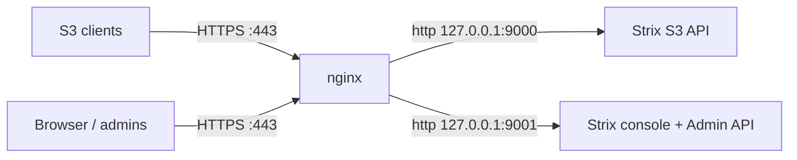

# Nginx Setup (TLS)

Strix does not terminate TLS itself. For any deployment beyond local testing,
put it behind nginx (or Caddy/Traefik) for HTTPS. This is a step-by-step
walkthrough to get a working TLS front end. For the full reference — buffering,
timeouts, TLS hardening, and pitfalls — see
[Reverse Proxy & TLS](../guides/reverse-proxy.md).

## Topology

Expose the S3 API and the console on separate hostnames; keep metrics private.



| Hostname | Proxies to | Used by |
|----------|------------|---------|
| `s3.example.com` | `127.0.0.1:9000` | S3 clients / SDKs |
| `console.example.com` | `127.0.0.1:9001` | Admins (web UI + Admin API) |

> Use **separate subdomains**, not subpaths. S3 path-style URLs use the whole
> path for `bucket/key`, so hosting the S3 API under `example.com/s3/...` breaks
> bucket addressing.

## 1. Bind Strix to Loopback

Let nginx face the network; keep Strix on localhost. With Docker, publish only
to loopback:

```yaml
# deploy/docker-compose.yml override
services:
  strix:
    ports:
      - "127.0.0.1:9000:9000"
      - "127.0.0.1:9001:9001"
```

Running the binary directly:

```bash
strix --address 127.0.0.1:9000 --console-address 127.0.0.1:9001
```

## 2. Install nginx

```bash
# Debian / Ubuntu
sudo apt install nginx

# Arch
sudo pacman -S nginx
```

Certificates are issued separately with **acme.sh** using DNS-01 validation
(preferred over HTTP-01 — it supports wildcards and needs no inbound port 80).
See [TLS with acme.sh](../guides/tls-acme.md). Point the server blocks below at
the issued cert/key paths.

## 3. Server Blocks

Create `/etc/nginx/sites-available/strix.conf` (or a file in `conf.d/`):

```nginx
# ---- S3 API ----------------------------------------------------------------
server {
    listen 443 ssl http2;
    server_name s3.example.com;

    ssl_certificate     /etc/letsencrypt/live/s3.example.com/fullchain.pem;
    ssl_certificate_key /etc/letsencrypt/live/s3.example.com/privkey.pem;

    # Object uploads can be large (0 = unlimited).
    client_max_body_size 0;

    location / {
        proxy_pass http://127.0.0.1:9000;

        # SigV4 signs the Host header — pass it through unchanged.
        proxy_set_header Host              $host;
        proxy_set_header X-Real-IP         $remote_addr;
        proxy_set_header X-Forwarded-For   $proxy_add_x_forwarded_for;
        proxy_set_header X-Forwarded-Proto $scheme;

        # Stream large bodies instead of buffering to disk.
        proxy_request_buffering off;
        proxy_buffering         off;
        proxy_http_version      1.1;
        proxy_read_timeout      300s;
        proxy_send_timeout      300s;
    }
}

# ---- Console + Admin API ---------------------------------------------------
server {
    listen 443 ssl http2;
    server_name console.example.com;

    ssl_certificate     /etc/letsencrypt/live/console.example.com/fullchain.pem;
    ssl_certificate_key /etc/letsencrypt/live/console.example.com/privkey.pem;

    client_max_body_size 0;

    location / {
        proxy_pass http://127.0.0.1:9001;

        proxy_set_header Host              $host;
        proxy_set_header X-Real-IP         $remote_addr;
        proxy_set_header X-Forwarded-For   $proxy_add_x_forwarded_for;
        proxy_set_header X-Forwarded-Proto $scheme;

        proxy_request_buffering off;
        proxy_buffering         off;
        proxy_http_version      1.1;
    }
}

# ---- HTTP -> HTTPS ---------------------------------------------------------
server {
    listen 80;
    server_name s3.example.com console.example.com;
    return 301 https://$host$request_uri;
}
```

Enable and reload:

```bash
sudo ln -s /etc/nginx/sites-available/strix.conf /etc/nginx/sites-enabled/
sudo nginx -t && sudo systemctl reload nginx
```

## 4. Issue Certificates (acme.sh, DNS-01)

Issue a wildcard cert with acme.sh so a single cert/key covers both hostnames,
then install it to the paths referenced above:

```bash
acme.sh --issue --dns dns_cf -d example.com -d '*.example.com'

acme.sh --install-cert -d example.com \
  --key-file       /etc/letsencrypt/live/example.com/privkey.pem \
  --fullchain-file /etc/letsencrypt/live/example.com/fullchain.pem \
  --reloadcmd      "systemctl reload nginx"
```

acme.sh installs its own auto-renewal timer. Full Cloudflare/Azure DNS setup:
[TLS with acme.sh](../guides/tls-acme.md).

## 5. Point Clients at the Proxy

```bash
export AWS_ACCESS_KEY_ID=admin
export AWS_SECRET_ACCESS_KEY=change-me

# Path-style + the proxy hostname
aws --endpoint-url https://s3.example.com s3 ls
```

The web console is now at `https://console.example.com`.

## SSO Redirect URIs

If you enable SSO, register the redirect URI against the **public console
hostname**:

```
https://console.example.com/api/v1/auth/callback
```

See [SSO/OIDC](../guides/sso-oidc.md) and the
[Entra ID walkthrough](../guides/entra-sso.md).

## Verifying

```bash
# S3 through the proxy
aws --endpoint-url https://s3.example.com s3 ls

# Console health through the proxy
curl https://console.example.com/health/ready
```

## Common Pitfalls

| Symptom | Cause / fix |
|---------|-------------|
| `SignatureDoesNotMatch` | `Host` header rewritten — keep `proxy_set_header Host $host;` and sign for the proxy hostname |
| `413 Request Entity Too Large` | Raise `client_max_body_size` (use `0` for unlimited) |
| Uploads stall or fill `/tmp` | Buffering is on — set `proxy_request_buffering off;` |
| Bucket addressing broken | S3 API hosted under a subpath — use a dedicated subdomain instead |

For TLS hardening (protocols, ciphers, HSTS) and Caddy/Traefik equivalents, see
[Reverse Proxy & TLS](../guides/reverse-proxy.md).
