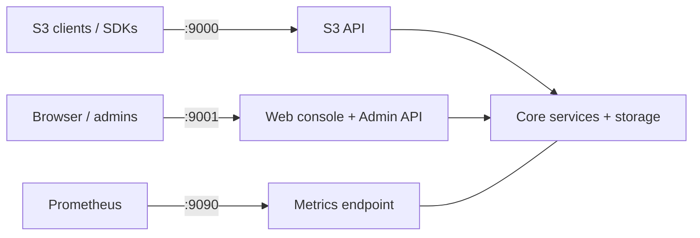

# Strix Quick Start Guide

This guide will help you get Strix up and running in minutes.

## Ports at a Glance

A single `strix` process serves three listeners:



| Port | Listener | Default bind |
|------|----------|--------------|
| 9000 | S3 API | `0.0.0.0:9000` |
| 9001 | Web console + Admin API | `0.0.0.0:9001` |
| 9090 | Prometheus metrics | `127.0.0.1:9090` (loopback) |

## Installation

### From Source

```bash
# Clone the repository
git clone https://github.com/CK-Technology/strix.git
cd strix

# Build in release mode
cargo build --release

# The binary will be at target/release/strix
```

### Using Docker

```bash
docker run -d \
  -p 9000:9000 -p 9001:9001 \
  -e STRIX_ROOT_USER=admin \
  -e STRIX_ROOT_PASSWORD=password123 \
  -v strix-data:/var/lib/strix \
  ghcr.io/ck-technology/strix:latest
```

## Running Strix

### Basic Usage

```bash
# Set root credentials (required)
export STRIX_ROOT_USER=admin
export STRIX_ROOT_PASSWORD=password123

# Start with default settings
strix --data-dir ./data

# Or specify options
strix --data-dir ./data --address 0.0.0.0:9000 --console-address 0.0.0.0:9001
```

### Command Line Options

```
Options:
  --data-dir <PATH>        Data directory [default: /var/lib/strix]
  --address <ADDR>         S3 API address [default: 0.0.0.0:9000]
  --console-address <ADDR> Admin console address [default: 0.0.0.0:9001]
  --metrics-address <ADDR> Metrics endpoint address [default: 127.0.0.1:9090]
  --log-level <LEVEL>      Log level [default: info]
  --log-json               Enable JSON log format
  --jwt-secret <SECRET>    Base64 JWT signing secret (32+ decoded bytes)
  -h, --help               Print help
  -V, --version            Print version
```

## First Steps

### 1. Create a Bucket

Using the AWS CLI:

```bash
# Configure credentials
export AWS_ACCESS_KEY_ID=admin
export AWS_SECRET_ACCESS_KEY=password123
export AWS_ENDPOINT_URL=http://localhost:9000

# Create a bucket
aws s3 mb s3://my-bucket

# List buckets
aws s3 ls
```

### 2. Upload an Object

```bash
# Upload a file
aws s3 cp myfile.txt s3://my-bucket/

# Upload with metadata
aws s3 cp myfile.txt s3://my-bucket/ --metadata "author=alice,version=1.0"
```

### 3. Download an Object

```bash
# Download a file
aws s3 cp s3://my-bucket/myfile.txt ./downloaded.txt
```

### 4. List Objects

```bash
# List all objects
aws s3 ls s3://my-bucket/

# Recursive listing
aws s3 ls s3://my-bucket/ --recursive
```

## User Management

### Using the Admin API

```bash
# Login with access key credentials
TOKEN=$(curl -s -X POST http://localhost:9001/api/v1/login \
  -H "Content-Type: application/json" \
  -d '{"access_key_id":"admin","secret_access_key":"password123"}' \
  | jq -r '.token')

# Create a user
curl -X POST http://localhost:9001/api/v1/users \
  -H "Authorization: Bearer $TOKEN" \
  -H "Content-Type: application/json" \
  -d '{"username":"alice"}'
```

### Using the sx CLI

```bash
# Set up alias with admin URL
sx alias set local http://localhost:9000 admin password123 \
  --admin-url http://localhost:9001

# Create user
sx user add local alice

# Create access keys
sx key create local alice
```

Save the returned `access_key_id` and `secret_access_key` — the secret is only shown once.

## Enable Versioning

```bash
# Enable versioning on a bucket
aws s3api put-bucket-versioning \
  --bucket my-bucket \
  --versioning-configuration Status=Enabled

# Check versioning status
aws s3api get-bucket-versioning --bucket my-bucket
```

## Server-Side Encryption

### SSE-S3 (Server-Managed Keys)

```bash
# Upload with SSE-S3
aws s3 cp myfile.txt s3://my-bucket/ \
  --sse AES256
```

### SSE-C (Customer-Provided Keys)

```bash
# Generate a 256-bit key
KEY=$(openssl rand -base64 32)

# Upload with SSE-C
aws s3 cp myfile.txt s3://my-bucket/ \
  --sse-c AES256 \
  --sse-c-key "$KEY"

# Download with SSE-C (same key required)
aws s3 cp s3://my-bucket/myfile.txt ./decrypted.txt \
  --sse-c AES256 \
  --sse-c-key "$KEY"
```

## Monitoring

### Health Checks

```bash
# Liveness probe
curl http://localhost:9000/health/live

# Readiness probe (verifies storage + DB)
curl http://localhost:9000/health/ready

# MinIO-compatible health endpoints
curl http://localhost:9000/minio/health/live
curl http://localhost:9000/minio/health/ready
```

### Prometheus Metrics

Strix exposes Prometheus metrics at `http://localhost:9090/metrics` (loopback only by default).

## Web Console

Strix includes a web-based admin console at `http://localhost:9001`. Log in with your root credentials.

## Troubleshooting

### Common Issues

**Cannot connect to S3 endpoint:**
- Check that the server is running: `curl http://localhost:9000/health/live`
- Verify the endpoint URL in your client configuration
- Ensure `force_path_style` is enabled (not virtual-hosted style)

**Authentication failures:**
- Verify your access key and secret are correct
- Check that the user has the necessary permissions

### Logs

```bash
# Run with debug logging
strix --log-level debug

# JSON format for log aggregation
strix --log-level debug --log-json
```

## Next Steps

- [S3 Compatibility Guide](../reference/s3-compatibility.md) — API compatibility matrix
- [CLI Reference](../reference/cli.md) — Complete `sx` command reference
- [Admin API Reference](../reference/admin-api.md) — REST API for management
- [IAM & Policies](../guides/iam-policies.md) — Access control documentation
- [Architecture Overview](../internals/architecture.md) — System design and internals
