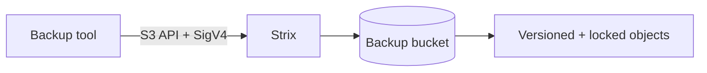

# Using Strix as an S3 Backup Target

Because Strix speaks the S3 API, it works as a drop-in backup destination for
any tool that supports S3-compatible storage — `restic`, `rclone`, Duplicati,
Veeam, `borg` (via rclone), Kopia, and more. This guide covers the recommended
setup and tool-specific examples.

> For backing up **Strix's own data directory**, see
> [backup-recovery.md](backup-recovery.md). This guide is about pointing
> external backup tools **at** Strix.

## How It Works



A backup tool authenticates with an access key, writes deduplicated/encrypted
chunks as S3 objects into a dedicated bucket, and reads them back to restore.
Strix features that matter for backups:

- **Path-style addressing** — point tools at the Strix endpoint with path-style
  enabled (`force_path_style` / `use_path_style_endpoint`).
- **Versioning** — protects against accidental overwrite/delete.
- **Object Lock (WORM)** — Governance/Compliance retention for ransomware-
  resistant, immutable backups.
- **Lifecycle rules** — expire old versions/incomplete multipart uploads.
- **Server-side encryption (SSE-S3)** — at-rest encryption in addition to any
  client-side encryption the tool performs.

## Recommended Setup

### 1. Create a dedicated user and bucket

```bash
# Create a backup user and access key
sx user add local backups
sx key create local backups   # save the access_key_id / secret_access_key

# Create the destination bucket
aws --endpoint-url https://s3.example.com s3 mb s3://backups
```

### 2. Scope the user's policy to that bucket

Attach an IAM policy granting access only to the backup bucket (see
[iam-policies.md](iam-policies.md)):

```json
{
  "Version": "2012-10-17",
  "Statement": [
    {
      "Effect": "Allow",
      "Action": ["s3:ListBucket", "s3:GetBucketLocation"],
      "Resource": "arn:aws:s3:::backups"
    },
    {
      "Effect": "Allow",
      "Action": ["s3:PutObject", "s3:GetObject", "s3:DeleteObject"],
      "Resource": "arn:aws:s3:::backups/*"
    }
  ]
}
```

### 3. Enable immutability (optional but recommended)

```bash
# Versioning
aws --endpoint-url https://s3.example.com s3api put-bucket-versioning \
  --bucket backups --versioning-configuration Status=Enabled

# Object Lock retention (governance mode example)
aws --endpoint-url https://s3.example.com s3api put-object-lock-configuration \
  --bucket backups \
  --object-lock-configuration '{"ObjectLockEnabled":"Enabled","Rule":{"DefaultRetention":{"Mode":"GOVERNANCE","Days":30}}}'
```

> Object Lock must be enabled at bucket creation for full S3 parity; create the
> bucket with `--object-lock-enabled-for-bucket` if your tooling requires it.

## Tool Examples

### restic

```bash
export AWS_ACCESS_KEY_ID=<access-key>
export AWS_SECRET_ACCESS_KEY=<secret-key>
export RESTIC_REPOSITORY="s3:https://s3.example.com/backups/restic"
export RESTIC_PASSWORD=<repo-password>

restic init
restic backup /etc /home /var/www
restic snapshots
restic prune
```

restic uses ranged GETs heavily during `prune`/`check`; Strix returns precise
`Content-Range`/`Content-Length` headers for compatibility.

### rclone

```ini
# ~/.config/rclone/rclone.conf
[strix]
type = s3
provider = Other
access_key_id = <access-key>
secret_access_key = <secret-key>
endpoint = https://s3.example.com
force_path_style = true
```

```bash
# Sync a directory to the backup bucket
rclone sync /data strix:backups/data --progress

# Some workloads need unsigned payloads
rclone sync /data strix:backups/data --s3-use-unsigned-payload
```

### Duplicati

- **Storage Type:** S3 Compatible
- **Server/Endpoint:** `s3.example.com` (use the path-style/custom endpoint
  field)
- **Bucket name:** `backups`
- **Access/Secret keys:** the backup user's key pair
- Enable **path-style** addressing.

### Veeam (S3-Compatible Object Storage)

- Add an **S3 Compatible** object storage repository.
- **Service point:** `https://s3.example.com`
- **Region:** any non-empty value (e.g. `us-east-1`) — Strix ignores region but
  Veeam requires a value.
- Select the `backups` bucket and a folder.
- For immutability, enable Veeam's object-lock option against a versioned,
  Object-Lock-enabled bucket.

## TLS and Endpoints

Always back up over HTTPS. Terminate TLS at a reverse proxy
(see [reverse-proxy.md](reverse-proxy.md)) and point tools at the public S3
hostname with path-style addressing. SigV4 signs the `Host` header, so the
endpoint the tool signs for must match the proxy hostname.

## Verifying a Backup Path

```bash
# Confirm the tool can list the bucket
aws --endpoint-url https://s3.example.com s3 ls s3://backups/

# Confirm versioning is active
aws --endpoint-url https://s3.example.com s3api get-bucket-versioning --bucket backups
```

## Best Practices

1. **One user/bucket per backup workload**, scoped with a least-privilege policy.
2. **Enable versioning + Object Lock** for ransomware resistance.
3. **Use lifecycle rules** to expire old versions and abort stale multipart
   uploads.
4. **Test restores regularly** — a backup is only as good as its last verified
   restore.
5. **Layer encryption** — keep the backup tool's client-side encryption on even
   with SSE-S3 enabled.
