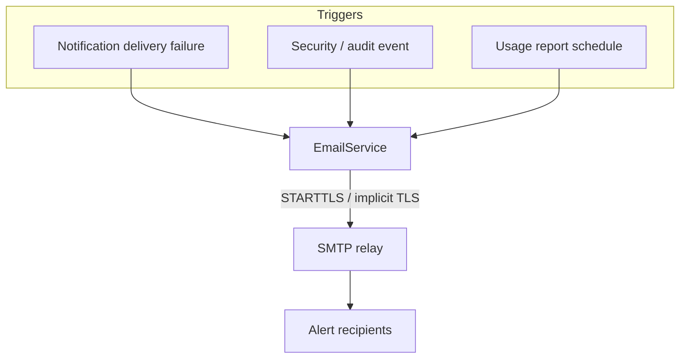

# Email Alerts & Reports (SMTP Relay)

Strix can send outbound email through an SMTP relay (for example,
[SMTP2Go](https://www.smtp2go.com/), Amazon SES, Postmark, or any SMTP server).
Email powers three optional features: delivery-failure alerts, security/audit
alerts, and scheduled storage usage reports.

The SMTP password is encrypted at rest (AES-256-GCM) and is write-only across
the admin API — it is never returned in responses. Configuration is stored in
the IAM database as a single row; environment variables seed it on first boot,
after which the console is the source of truth.

## What Gets Sent



| Trigger | Field | Description |
|---------|-------|-------------|
| Delivery-failure alerts | `alert_on_delivery_failure` | Email when a webhook/event notification delivery is marked failed. |
| Security/audit alerts | `alert_on_audit_events` | Email on audit events such as denied requests and privileged changes. |
| Usage reports | `send_usage_reports` + `usage_report_schedule` | Periodic storage usage digest, sent `daily` or `weekly`. |

All three deliver to the configured `alert_recipients` list.

## Environment-Variable Seeding

On first boot, these variables seed the SMTP configuration. They are read once;
the console manages the configuration thereafter.

| Variable | Default | Description |
|----------|---------|-------------|
| `STRIX_SMTP_HOST` | (unset) | SMTP relay hostname (e.g. `mail.smtp2go.com`) |
| `STRIX_SMTP_PORT` | `587` | Relay port (587 for STARTTLS, 465 for implicit TLS) |
| `STRIX_SMTP_USER` | (unset) | SMTP username |
| `STRIX_SMTP_PASS` | (unset) | SMTP password (encrypted at rest) |
| `STRIX_SMTP_FROM` | (unset) | From address for outbound mail |

```bash
STRIX_SMTP_HOST=mail.smtp2go.com
STRIX_SMTP_PORT=587
STRIX_SMTP_USER=<relay-username>
STRIX_SMTP_PASS=<relay-password>
STRIX_SMTP_FROM=alerts@your-domain.example
```

Seeding only sets the relay connection. Enable the individual triggers and set
recipients from the console (or via the admin API).

## Configuring in the Console

Open **Settings → Email** (root user only):

1. Toggle **Enable email** and enter the relay host, port, username, and
   password. The password is write-only — leave it blank when editing to
   preserve the stored value.
2. Set the **From address** (and optional display name).
3. Choose **STARTTLS** (port 587) or implicit TLS (port 465).
4. Enable the triggers you want and add one or more **alert recipients**.
5. For usage reports, pick a **daily** or **weekly** schedule.
6. Save, then use **Send test email** to confirm delivery.

## Admin API Endpoints

Email configuration is root-only and lives under `/api/v1/admin/smtp`:

| Method | Path | Description |
|--------|------|-------------|
| `GET` | `/api/v1/admin/smtp` | Get the current config (password omitted) |
| `PUT` | `/api/v1/admin/smtp` | Update config (empty password preserves the stored one) |
| `POST` | `/api/v1/admin/smtp/test` | Send a test email (optional `to` override) |

### Configuration fields

| Field | Type | Notes |
|-------|------|-------|
| `enabled` | bool | Master on/off for outbound email |
| `host` | string | Relay hostname |
| `port` | number | Relay port (587 / 465) |
| `username` | string | SMTP username |
| `password` | string | Write-only; omitted from `GET` responses |
| `from_address` | string | Envelope/From address |
| `from_name` | string? | Optional From display name |
| `use_starttls` | bool | STARTTLS (true) vs implicit TLS (false) |
| `alert_on_delivery_failure` | bool | Delivery-failure alert trigger |
| `send_usage_reports` | bool | Usage report trigger |
| `usage_report_schedule` | string | `daily` or `weekly` |
| `alert_on_audit_events` | bool | Security/audit alert trigger |
| `alert_recipients` | string[] | Recipient addresses |

## Security Considerations

1. **Password at rest**: stored encrypted (AES-256-GCM); never returned by the API.
2. **TLS in transit**: use STARTTLS (587) or implicit TLS (465); plaintext SMTP
   is not recommended.
3. **Root-only**: only the root user can view or change email configuration.

## Troubleshooting

### Test email fails

1. Verify the relay host, port, username, and password.
2. Confirm the TLS mode matches the port (STARTTLS → 587, implicit TLS → 465).
3. Check that the relay allows your `from_address` (some providers require a
   verified sender).
4. Review Strix logs for SMTP handshake or authentication errors.

### Alerts not arriving

1. Confirm `enabled` is on and the relevant trigger is enabled.
2. Confirm `alert_recipients` is non-empty.
3. Check spam folders and relay delivery logs.
