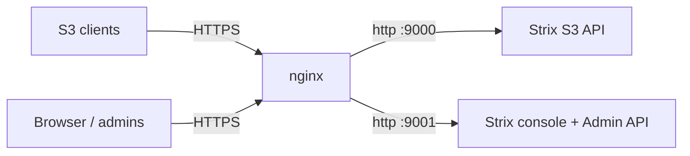

# Reverse Proxy & TLS Termination (nginx)

Strix does not terminate TLS itself. In production you should run it behind a
TLS-terminating reverse proxy. This guide uses nginx; the same principles apply
to Caddy, Traefik, or HAProxy.

> **Ready-made config:** the repo ships a complete, production drop-in at
> [`deploy/nginx/strix.conf`](https://github.com/CK-Technology/strix/blob/main/deploy/nginx/strix.conf)
> (`s3.cktechnology.io` → `:9000`, `strix.cktechnology.io` → `:9001`). Issue the
> wildcard cert with [acme.sh (DNS-01)](tls-acme.md). The sections below explain
> what every directive does and how to debug the S3 side.

A single Strix process exposes three listeners:

| Port | Purpose | Expose publicly? |
|------|---------|------------------|
| 9000 | S3 API | Yes (to S3 clients) |
| 9001 | Web console + Admin API | Yes (to admins) |
| 9090 | Prometheus metrics | No — keep on the management network |



## Key Requirements

Object storage has a few proxy needs that differ from a typical web app:

1. **Large uploads** — raise or disable `client_max_body_size`. S3 `PutObject`
   and multipart parts can be gigabytes.
2. **Streaming, not buffering** — disable request/response buffering so large
   GET/PUT bodies stream instead of spooling to disk.
3. **Preserve the Host header** — AWS SigV4 signs the `Host` header. If nginx
   rewrites it, signatures fail. Always pass the original `Host`.
4. **Path-style addressing** — Strix uses path-style buckets
   (`https://s3.example.com/bucket/key`). Point clients at the proxy host and
   enable `force_path_style` / `use_path_style_endpoint`.
5. **Don't collapse slashes** — object keys may contain `//`. nginx merges
   duplicate slashes by default, which corrupts those keys. Set
   `merge_slashes off;`.

## Why the S3 API is the hard part

The console (port 9001) proxies like any web app. The S3 API (port 9000) is
where people get stuck, because S3 clients sign requests and are picky about how
the path and headers arrive. The four failure modes, in order of frequency:

1. **`SignatureDoesNotMatch` — rewritten Host.** SigV4 includes the `Host`
   header in the signed canonical request. If nginx forwards a different host
   (e.g. it passes `127.0.0.1:9000` upstream), the signature Strix recomputes
   won't match. Fix: `proxy_set_header Host $host;` **and** make the client sign
   for the proxy hostname (point the SDK's endpoint at `https://s3.example.com`,
   not the origin).

2. **Broken keys — merged slashes.** A client storing `logs/2026//app.log`
   expects that exact key back. nginx's default `merge_slashes on` rewrites the
   path to `logs/2026/app.log` before proxying, so GET/HEAD later 404s. Fix:
   `merge_slashes off;`.

3. **Bucket addressing — path vs. virtual-host style.** Strix uses **path-style**
   (`https://s3.example.com/bucket/key`). Hosting the S3 API under a subpath
   (`example.com/s3/...`) is **not supported** — the path *is* `bucket/key`. Give
   the S3 API its own subdomain and set `force_path_style` /
   `use_path_style_endpoint` in the client.

4. **Stalled or rejected uploads — buffering & size limits.** `PutObject` and
   multipart parts can be gigabytes and arrive `Transfer-Encoding: chunked` with
   `Expect: 100-continue`. Defaults buffer the whole body to disk first (slow,
   fills `/tmp`) or reject it (`413`). Fix: `client_max_body_size 0;`,
   `proxy_request_buffering off;`, `proxy_buffering off;`, `proxy_http_version 1.1;`.

**Presigned URLs** work through the proxy as long as the host matches: a URL
presigned for `https://s3.example.com/...` carries the signature in the query
string and must be requested through the same hostname. Presign against the
public endpoint, not the origin.

### S3 proxy checklist

- [ ] `proxy_set_header Host $host;` (never the upstream address)
- [ ] Client endpoint = the public proxy hostname; client signs for it
- [ ] `merge_slashes off;`
- [ ] `client_max_body_size 0;` (or your true max object size)
- [ ] `proxy_request_buffering off;` and `proxy_buffering off;`
- [ ] `proxy_http_version 1.1;` (chunked uploads / keepalive)
- [ ] Dedicated subdomain for the S3 API (path-style, no subpath)

## S3 Endpoint (port 9000)

```nginx
server {
    listen 443 ssl http2;
    server_name s3.example.com;

    ssl_certificate     /etc/letsencrypt/live/s3.example.com/fullchain.pem;
    ssl_certificate_key /etc/letsencrypt/live/s3.example.com/privkey.pem;

    # Allow large objects (0 = unlimited; otherwise set to your max object size).
    client_max_body_size 0;

    # Preserve object keys that contain `//`.
    merge_slashes off;

    location / {
        proxy_pass http://127.0.0.1:9000;

        # Preserve the signed Host header for SigV4.
        proxy_set_header Host              $host;
        proxy_set_header X-Real-IP         $remote_addr;
        proxy_set_header X-Forwarded-For   $proxy_add_x_forwarded_for;
        proxy_set_header X-Forwarded-Proto $scheme;

        # Stream large bodies instead of buffering to disk.
        proxy_request_buffering  off;
        proxy_buffering          off;
        proxy_http_version       1.1;

        # Generous timeouts for big transfers.
        proxy_read_timeout    300s;
        proxy_send_timeout    300s;
    }
}
```

## Console + Admin API (port 9001)

The web console and the Admin API share port 9001. Both are served from the
same origin, so a single server block covers them.

```nginx
server {
    listen 443 ssl http2;
    server_name console.example.com;

    ssl_certificate     /etc/letsencrypt/live/console.example.com/fullchain.pem;
    ssl_certificate_key /etc/letsencrypt/live/console.example.com/privkey.pem;

    # Console uploads (object browser) also flow through here.
    client_max_body_size 0;

    location / {
        proxy_pass http://127.0.0.1:9001;

        proxy_set_header Host              $host;
        proxy_set_header X-Real-IP         $remote_addr;
        proxy_set_header X-Forwarded-For   $proxy_add_x_forwarded_for;
        proxy_set_header X-Forwarded-Proto $scheme;

        proxy_request_buffering off;
        proxy_buffering         off;
        proxy_http_version      1.1;
    }
}
```

> **OIDC redirect URIs:** when SSO is enabled, register the redirect URI against
> the public console hostname, e.g.
> `https://console.example.com/api/v1/auth/callback`. See
> [sso-oidc.md](sso-oidc.md).

## HTTP → HTTPS Redirect

```nginx
server {
    listen 80;
    server_name s3.example.com console.example.com;
    return 301 https://$host$request_uri;
}
```

## TLS Hardening

```nginx
ssl_protocols       TLSv1.2 TLSv1.3;
ssl_ciphers         ECDHE-ECDSA-AES128-GCM-SHA256:ECDHE-RSA-AES128-GCM-SHA256:ECDHE-ECDSA-AES256-GCM-SHA384:ECDHE-RSA-AES256-GCM-SHA384;
ssl_prefer_server_ciphers off;
ssl_session_cache   shared:SSL:10m;
ssl_session_timeout 1d;
add_header Strict-Transport-Security "max-age=63072000" always;
```

## Single-Host Layout (subpaths)

If you only have one hostname, you can split S3 and the console by subdomain
(recommended) or, less commonly, by listening on different ports through the
proxy. Subdomains are strongly preferred — S3 path-style URLs use the entire
path for `bucket/key`, so hosting the S3 API under a subpath
(`example.com/s3/...`) breaks bucket addressing and is not supported.

## Verifying

```bash
# S3 endpoint through the proxy (path-style)
aws --endpoint-url https://s3.example.com s3 ls

# Console health through the proxy
curl https://console.example.com/health/ready
```

Common pitfalls:

- **`SignatureDoesNotMatch`** — the `Host` header was rewritten. Ensure
  `proxy_set_header Host $host;` and that clients sign for the proxy hostname.
- **`413 Request Entity Too Large`** — raise `client_max_body_size`.
- **Uploads stall or fill `/tmp`** — buffering is on; set
  `proxy_request_buffering off;`.
- **Keys with `//` 404 after upload** — `merge_slashes` is on; set it `off`.
- **Works on the console but not S3** — the S3 API is hosted under a subpath or
  the client isn't using path-style. Give it a dedicated subdomain.
