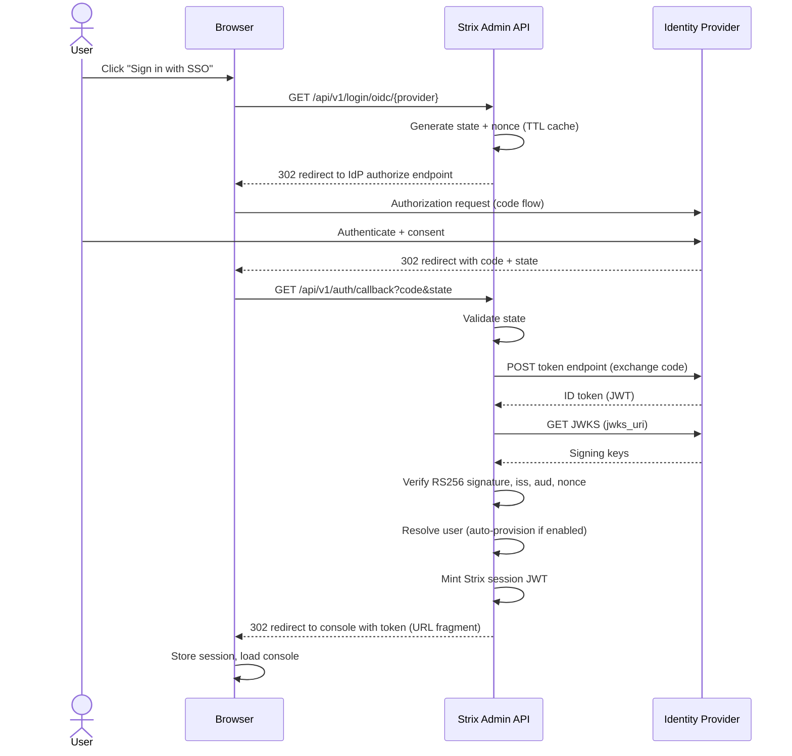

# SSO & OIDC Integration

Strix supports Single Sign-On (SSO) for the web console via OpenID Connect
(OIDC), using the OAuth2 Authorization Code flow with ID-token verification
(JWKS, RS256).

Providers are stored in the IAM database and managed from the console. Client
secrets are encrypted at rest and never returned by the API. Provider changes
hot-reload without a restart. Environment variables seed a provider on first
boot; afterwards the console is the source of truth.

## Supported Providers

- Azure AD (Microsoft Entra ID)
- Google Workspace
- Any OIDC-compliant identity provider exposing `.well-known/openid-configuration`

## Authentication Flow



## Environment-Variable Seeding

On first boot, if SSO is enabled and no provider exists, Strix seeds a provider
from these variables. They are read once; the console manages providers
thereafter.

| Variable | Default | Description |
|----------|---------|-------------|
| `STRIX_OIDC_ENABLED` | (unset) | Enable SSO and seed a provider on first boot |
| `STRIX_OIDC_PROVIDER` | `generic` | Provider preset: `generic`, `azure`, or `google` |
| `STRIX_OIDC_ISSUER` | (required) | Issuer URL (used for OIDC discovery) |
| `STRIX_OIDC_CLIENT_ID` | (required) | OAuth client ID |
| `STRIX_OIDC_CLIENT_SECRET` | (required) | OAuth client secret (encrypted at rest) |
| `STRIX_OIDC_REDIRECT_URI` | `http://<console>/api/v1/auth/callback` | Redirect/callback URI registered with the IdP |
| `STRIX_OIDC_SCOPES` | `openid email profile` | Space-separated scopes |
| `STRIX_OIDC_AUTO_CREATE` | `true` | Auto-provision users on first login |

### Azure AD (Entra ID)

1. Register an application in the Azure portal
   (Azure Active Directory → App registrations → New registration).
2. Set the redirect URI to `https://your-strix-domain/api/v1/auth/callback`.
3. Record the Application (client) ID, create a client secret, and note the
   Directory (tenant) ID.

```bash
STRIX_OIDC_ENABLED=true
STRIX_OIDC_PROVIDER=azure
STRIX_OIDC_ISSUER=https://login.microsoftonline.com/<tenant-id>/v2.0
STRIX_OIDC_CLIENT_ID=<client-id>
STRIX_OIDC_CLIENT_SECRET=<client-secret>
STRIX_OIDC_REDIRECT_URI=https://your-strix-domain/api/v1/auth/callback
```

The `azure` preset defaults the username claim to `preferred_username`.

For a full walkthrough (App registration vs. Enterprise application, client
secret, and exactly which API permissions are required), see
[entra-sso.md](entra-sso.md).

### Google Workspace

1. Create an OAuth client ID in the Google Cloud Console
   (APIs & Services → Credentials → OAuth client ID → Web application).
2. Add `https://your-strix-domain/api/v1/auth/callback` as an authorized
   redirect URI.

```bash
STRIX_OIDC_ENABLED=true
STRIX_OIDC_PROVIDER=google
STRIX_OIDC_ISSUER=https://accounts.google.com
STRIX_OIDC_CLIENT_ID=<client-id>
STRIX_OIDC_CLIENT_SECRET=<client-secret>
STRIX_OIDC_REDIRECT_URI=https://your-strix-domain/api/v1/auth/callback
```

The `google` preset defaults the username claim to `email`.

### Generic Provider

Any provider that supports the Authorization Code flow and publishes a
`.well-known/openid-configuration` document works:

```bash
STRIX_OIDC_ENABLED=true
STRIX_OIDC_PROVIDER=generic
STRIX_OIDC_ISSUER=https://your-idp.example.com
STRIX_OIDC_CLIENT_ID=<client-id>
STRIX_OIDC_CLIENT_SECRET=<client-secret>
STRIX_OIDC_SCOPES=openid email profile
```

## Managing Providers in the Console

Open **Identity → OpenID** (root user only):

1. Click **Add Provider** and choose a provider type. Selecting a type fills in
   issuer and claim defaults.
2. Enter the display name, client ID, and client secret. The secret is
   write-only — leave it blank when editing to preserve the stored value.
3. Use **Test discovery** to verify the issuer exposes a valid
   `.well-known/openid-configuration` document.
4. Save. Changes take effect immediately; no restart is required.

## User Mapping

When a user signs in via SSO, their username is taken from the configured
username claim. If auto-provisioning is enabled and the user does not exist, a
new user is created and the provider's default policy (if any) is attached.

| Field | Source |
|-------|--------|
| Username | Configured username claim (`preferred_username`, `email`, or `sub`) |
| Default policy | Provider's `default_policy`, attached on first login |

## Admin API Endpoints

Provider management is root-only and lives under `/api/v1/admin/oidc`:

| Method | Path | Description |
|--------|------|-------------|
| `GET` | `/api/v1/admin/oidc/providers` | List providers (secrets omitted) |
| `POST` | `/api/v1/admin/oidc/providers` | Create a provider |
| `GET` | `/api/v1/admin/oidc/providers/{id}` | Get a provider (secret omitted) |
| `PUT` | `/api/v1/admin/oidc/providers/{id}` | Update a provider (empty secret preserves the stored one) |
| `DELETE` | `/api/v1/admin/oidc/providers/{id}` | Delete a provider |

Public endpoints used by the login flow:

| Method | Path | Description |
|--------|------|-------------|
| `GET` | `/api/v1/auth/providers` | List enabled providers for login buttons |
| `GET` | `/api/v1/login/oidc/{provider}` | Begin the Authorization Code flow |
| `GET` | `/api/v1/auth/callback` | OAuth redirect/callback target |

## Security Considerations

1. **HTTPS required**: Always register HTTPS redirect URIs. Deploy Strix behind
   a TLS-terminating reverse proxy.
2. **Client secret**: Stored encrypted at rest (AES-256-GCM) and never returned
   by the API.
3. **CSRF protection**: The flow uses a one-time `state` value (TTL-bounded) and
   a `nonce` bound to the ID token.
4. **Token delivery**: The Strix session token is delivered to the browser via a
   URL fragment and stored in session storage.

## Troubleshooting

### Login fails

1. Confirm the redirect URI matches exactly (scheme, host, port, path).
2. Verify the client ID and secret.
3. Use **Test discovery** to confirm the issuer URL resolves.
4. Check Strix logs for signature/claim verification errors.

### User not created

1. Confirm the configured username claim is present in the ID token.
2. Confirm auto-provisioning (`STRIX_OIDC_AUTO_CREATE`) is enabled.
