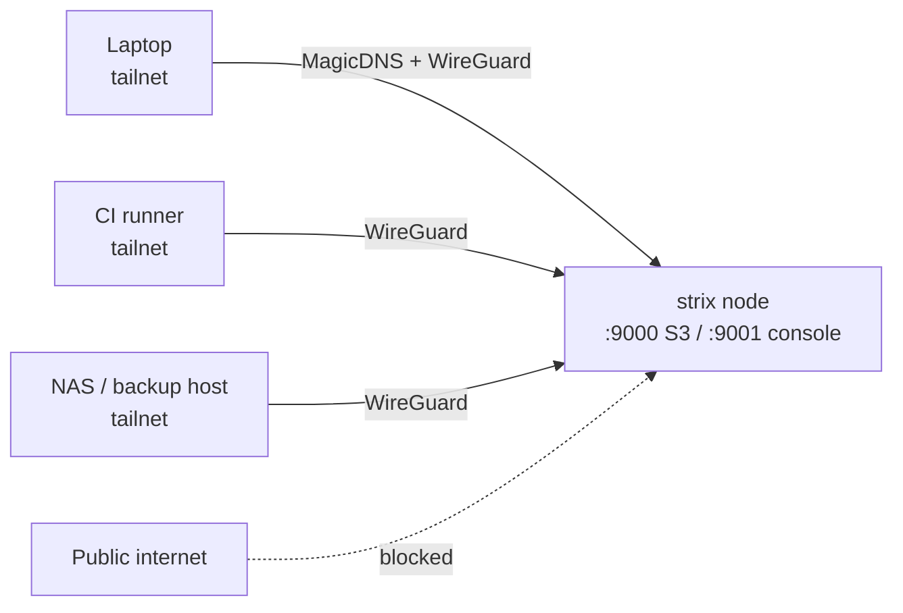

# Private Strix over Tailscale

For an internal-only deployment — backups, CI artifacts, a homelab, or an
internal team — you often don't want Strix on the public internet at all.
[Tailscale](https://tailscale.com) puts Strix on a private WireGuard mesh
(your *tailnet*) so only your devices can reach it, with no public ports, no
inbound firewall rules, and TLS handled for you.

This pairs well with — or fully replaces — a public [nginx](../getting-started/nginx.md)
front end. If every client is on the tailnet, you may not need a public reverse
proxy or a public DNS cert at all.



## Why Tailscale for internal Strix

- **No public exposure** — nothing listens on a public IP; ports 9000/9001 are
  only reachable inside the tailnet.
- **Identity-based access** — ACLs grant access per user/device, not per IP.
- **MagicDNS** — reach the node by name (`strix`), no IP juggling.
- **TLS without a public DNS challenge** — Tailscale issues a real cert for the
  node's `*.ts.net` name via `tailscale serve`.
- **Works anywhere** — laptops, CI runners, and other sites join the same flat
  network regardless of NAT.

## 1. Install Tailscale on the Strix Host

```bash
curl -fsSL https://tailscale.com/install.sh | sh
sudo tailscale up
```

In a Proxmox **LXC**, enable the TUN device for the container first (on the
host):

```bash
# /etc/pve/lxc/<id>.conf
lxc.cgroup2.devices.allow: c 10:200 rwm
lxc.mount.entry: /dev/net/tun dev/net/tun none bind,create=file
```

Then restart the container and `tailscale up` inside it. See
[Proxmox LXC](../getting-started/proxmox-lxc.md) for the base setup.

Note the node's MagicDNS name from `tailscale status` (e.g.
`strix.tailnet-name.ts.net`).

## 2. Keep Strix Off Public Interfaces

With Tailscale, you don't need a public bind. Either bind directly to the
Tailscale IP, or bind to all interfaces and let ACLs + the host firewall do the
gating. Binding to the tailnet/loopback only is the strongest:

```ini
# /etc/strix.env  (see Proxmox LXC / Configuration guides)
# 100.x.y.z is this node's Tailscale IP (from `tailscale ip -4`)
STRIX_ADDRESS=100.x.y.z:9000
STRIX_CONSOLE_ADDRESS=100.x.y.z:9001
STRIX_METRICS_ADDRESS=127.0.0.1:9090
```

Now the S3 API and console answer only on the tailnet. Confirm there is no
public listener:

```bash
ss -tlnp | grep -E '9000|9001'   # should show the 100.x.y.z address, not 0.0.0.0
```

## 3. Reach It from Other Devices

Any device on the tailnet can now use Strix by its MagicDNS name:

```bash
export AWS_ACCESS_KEY_ID=admin
export AWS_SECRET_ACCESS_KEY=change-me

aws --endpoint-url http://strix.tailnet-name.ts.net:9000 s3 ls
```

Console: `http://strix.tailnet-name.ts.net:9001`.

## 4. TLS via Tailscale Serve (optional, recommended)

Tailscale can issue a valid cert for the node's `*.ts.net` name and terminate
HTTPS for you — no nginx, no acme.sh, no public DNS challenge. Enable HTTPS
certs in the admin console (**DNS → HTTPS Certificates**), then:

```bash
# Terminate TLS for the console on standard 443, proxy to :9001
sudo tailscale serve --bg --https=443 http://127.0.0.1:9001

# And the S3 API on another port, e.g. 8443 -> :9000
sudo tailscale serve --bg --https=8443 http://127.0.0.1:9000
```

Clients then use:

```bash
aws --endpoint-url https://strix.tailnet-name.ts.net:8443 s3 ls
# console: https://strix.tailnet-name.ts.net
```

Because `tailscale serve` provides the cert and SNI host matches the request
host, SigV4 is happy — the same [S3 proxy rules](reverse-proxy.md) apply
(path-style, preserved Host).

> **Do not use `tailscale funnel`** for an internal-only deployment — Funnel
> exposes the service to the public internet, which defeats the purpose. Use
> `serve` (tailnet-only).

## 5. Lock It Down with ACLs

Tailnet ACLs decide who can reach Strix. Example: only the `backup` and `infra`
groups may hit the Strix node's ports.

```jsonc
// Tailscale admin console -> Access Controls
{
  "groups": {
    "group:infra":  ["alice@example.com", "bob@example.com"],
    "group:backup": ["restic-runner@example.com"]
  },
  "tagOwners": { "tag:strix": ["group:infra"] },
  "acls": [
    {
      "action": "accept",
      "src": ["group:infra", "group:backup"],
      "dst": ["tag:strix:9000", "tag:strix:9001", "tag:strix:443", "tag:strix:8443"]
    }
  ]
}
```

Tag the Strix node so the rules apply by tag, not hostname:

```bash
sudo tailscale up --advertise-tags=tag:strix
```

Now only members of `group:infra` and `group:backup` can open the S3 API or
console; everyone else on the tailnet is denied, and the public internet never
sees it.

## When to Combine with nginx

| Scenario | Approach |
|----------|----------|
| All clients on the tailnet | Tailscale only — `tailscale serve` for TLS, ACLs for access |
| Some external (non-tailnet) S3 clients | Public [nginx](../getting-started/nginx.md) + [acme.sh](tls-acme.md) for those; Tailscale for admin/console |
| Admin console private, S3 public | nginx on `s3.example.com`; console reachable only over the tailnet |

A common pattern: expose the **S3 API publicly** behind nginx for partner/backup
tools, but keep the **admin console tailnet-only** so management never touches
the public internet.

## Next Steps

- [Proxmox LXC](../getting-started/proxmox-lxc.md) — host setup (TUN device note)
- [Reverse Proxy & TLS](reverse-proxy.md) — S3 proxy rules that also apply to `tailscale serve`
- [Configuration](../getting-started/configuration.md) — bind addresses and all settings
- [Backup Targets](backup-targets.md) — restic/rclone over the tailnet
